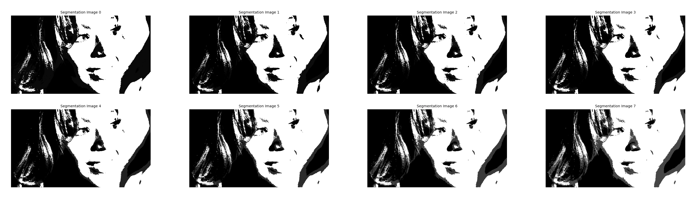

## Gaussian Mixture Models Tutorial

### Installation
The project requires Python 3 and pip: 

    git clone https://github.com/alexhagiopol/gmm
    cd gmm
    pip install -r requirements.txt

### Usage
Command line parameter definitions:

    -h, --help            show help message
    --first-image Path to image file. Must be specified.
    --second-image Path to image file. May or may not be specified.
    --components Number of components in the mixture of Gaussians. Must be specified.
    --iterations Number of Expectation Maximization iterations. Must be specified.

#### Example Commands
Segment a single image:

    python gmm_segmentation.py --first-image=example_data/beyonce.jpg --components=3 --iterations=8

Segment the difference between a pair of images:

    python gmm_segmentation.py --first-image=example_data/image_pairs/1_background.png --second-image=example_data/image_pairs/1_foreground.png --components=2 --iterations=5

Example results:
    

