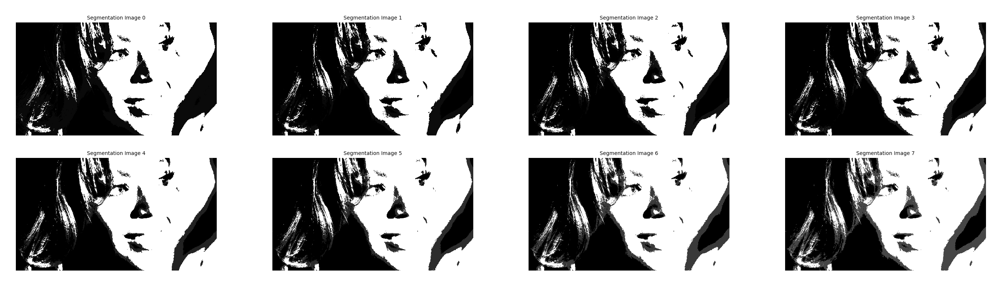

## Gaussian Mixture Models Tutorial

### Installation

Before cloning the project, be sure you have [Git LFS](https://git-lfs.github.com)
installed to be able to clone the non-code files in this repo e.g. images.

    git clone https://github.com/alexhagiopol/gmm
    cd gmm

### Usage

At present the program only supports grayscale images. Parameter definitions:

    python gmm_segmentation.py image_filepath num_components num_iterations

Specific example:

    python gmm_segmentation.py images/beyonce.jpg 3 8

Example results:
    

